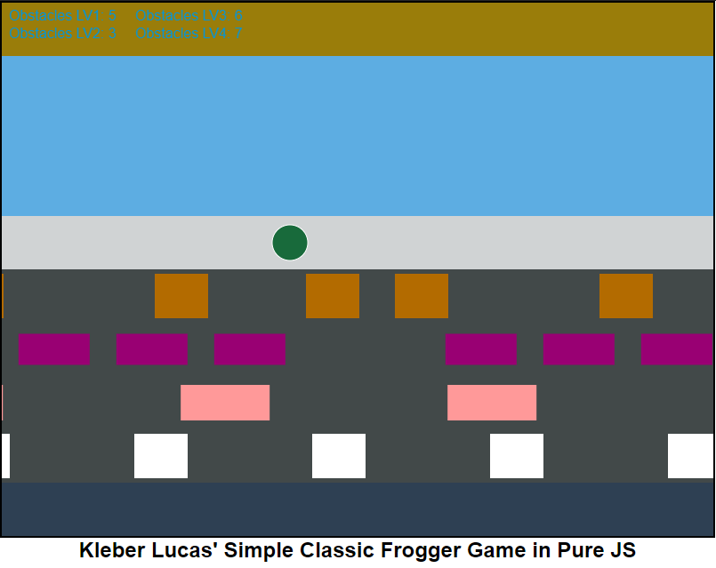

# FroggerGameJS
A simple frogger game made in pure JS

Um jogo Frogger simples feito em JS Puro

_This project was developed using canvas and pure Javascript, without the use of pluggins or frameworks._

_My inspiration for the creation of the project was the version of Atari 2600._

_Este projeto foi desenvolvido usando canvas e Javascript puro, sem a utilização de pluggins ou frameworks._

_A minha inspiração para criação do projeto foi a versão de Atari 2600._

### Current appearance of the game | Aparencia atual do jogo



### Prerequisites
```
To run the game you just need to use your favorite browser.

Para rodar o jogo você só precisa usar seu navegador favorito.
```

# Tasks / Tarefas

- [X] Implement player movement
- [X] Implement generation of street obstacles
- [X] Clear enemies when they leave the screen
- [ ] Implement generation of water obstacles
- [ ] Implement lives
- [ ] Implement score and wins
- [ ] Optimize Code
- [ ] Add different patterns to the obstacles

## Authors

* **Kleber Lucas** - *Initial work* - [FroggerGameJS](https://github.com/KleberLucas/FroggerGameJS)

## License

This project is licensed under the MIT License - see the [LICENSE.md](LICENSE.md) file for details

